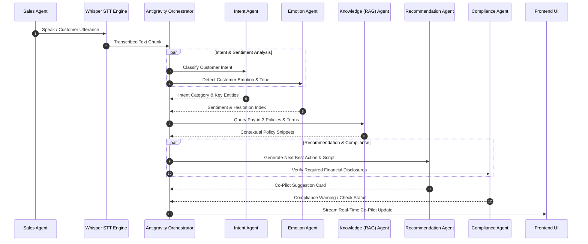
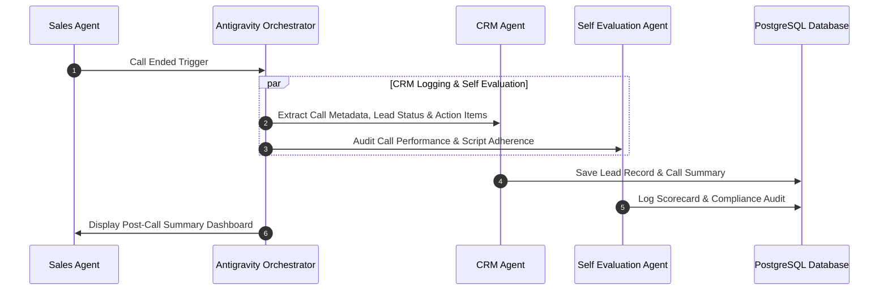

# Agent Workflow & Orchestration Pipeline

## Turn Processing Sequence

```mermaid
sequenceDiagram
    autonumber
    participant Rep as Sales Agent
    participant STT as Whisper STT Engine
    participant Orch as Antigravity Orchestrator
    participant Intent as Intent Agent
    participant Emotion as Emotion Agent
    participant RAG as Knowledge (RAG) Agent
    participant Rec as Recommendation Agent
    participant Comp as Compliance Agent
    participant Dashboard as Frontend UI

    Rep->>STT: Speak / Customer Utterance
    STT->>Orch: Transcribed Text Chunk
    
    par Intent & Sentiment Analysis
        Orch->>Intent: Classify Customer Intent
        Orch->>Emotion: Detect Customer Emotion & Tone
    end

    Intent-->>Orch: Intent Category & Key Entities
    Emotion-->>Orch: Sentiment & Hesitation Index

    Orch->>RAG: Query Pay-in-3 Policies & Terms
    RAG-->>Orch: Contextual Policy Snippets

    par Recommendation & Compliance
        Orch->>Rec: Generate Next Best Action & Script
        Orch->>Comp: Verify Required Financial Disclosures
    end

    Rec-->>Orch: Co-Pilot Suggestion Card
    Comp-->>Orch: Compliance Warning / Check Status

    Orch->>Dashboard: Stream Real-Time Co-Pilot Update
```

## Post-Call Sequence

```mermaid
sequenceDiagram
    autonumber
    participant Rep as Sales Agent
    participant Orch as Antigravity Orchestrator
    participant CRM as CRM Agent
    participant Eval as Self Evaluation Agent
    participant DB as PostgreSQL Database

    Rep->>Orch: Call Ended Trigger
    
    par CRM Logging & Self Evaluation
        Orch->>CRM: Extract Call Metadata, Lead Status & Action Items
        Orch->>Eval: Audit Call Performance & Script Adherence
    end

    CRM->>DB: Save Lead Record & Call Summary
    Eval->>DB: Log Scorecard & Compliance Audit
    Orch->>Rep: Display Post-Call Summary Dashboard
```
