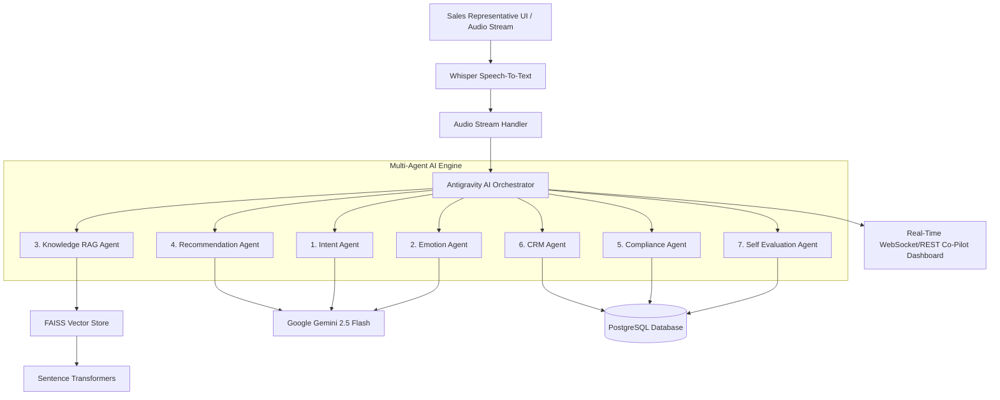

# System Architecture

## Architecture Overview

The AI Voice Co-Pilot for Inside Sales is built as an enterprise, asynchronous, multi-agent AI system designed to assist agents in real-time during Pay-in-3 Zero-Cost EMI customer calls.

## Component Description

1. **Frontend (React + Vite + Tailwind CSS)**: Renders live transcription, real-time next best action cards, product matrix popups, compliance alerts, and post-call evaluation summaries.
2. **FastAPI Backend**: Serves asynchronous REST endpoints and WebSocket streams for real-time audio chunk processing.
3. **Antigravity AI Orchestrator**: Coordinates parallel and sequential agent tasks, manages turn state, and synthesizes output payload for the frontend.
4. **Knowledge Retrieval Layer**: Built with Sentence Transformers and FAISS, querying Fintech Pay-in-3 documentation.
5. **Database**: PostgreSQL with async ORM for storing call sessions, CRM leads, compliance audit logs, and self-evaluations.
